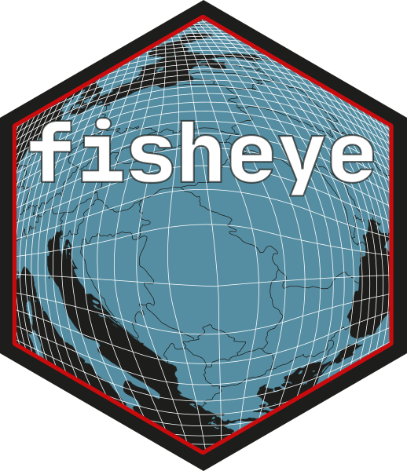
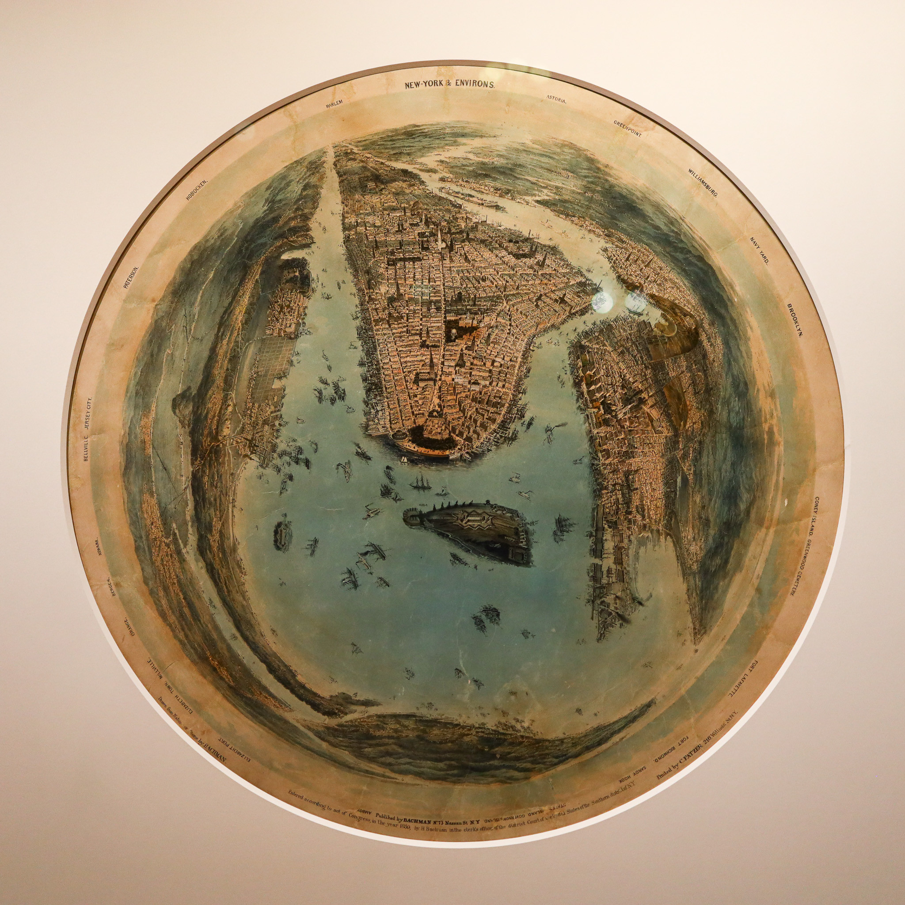

```{r, include = FALSE}
knitr::opts_chunk$set(
  collapse = TRUE,
  comment = "#>",
  fig.path = "man/figures/README-",
  out.width = "100%"
)
```

# fisheye 

<!-- badges: start -->

[](https://app.codecov.io/gh/riatelab/fisheye?branch=main)
[](https://github.com/riatelab/fisheye/actions/workflows/R-CMD-check.yaml)
<!-- badges: end -->

The goal of fisheye is to create base maps focusing on a specific location using an azimuthal logarithmic distance transformation.


    

<small>John Bachmann, [New York and environs](https://digitalcollections.nypl.org/items/510d47e3-b9bd-a3d9-e040-e00a18064a99), 1859.</small> 


## Installation

You can install the released version of `fisheye` from
[CRAN](https://cran.r-project.org/package=fisheye) with:

``` r
install.packages("fisheye")
```

Alternatively, you can install the development version of `fisheye` from
GitHub with:

``` r
remotes::install_github("riatelab/fisheye")
```
## Example

This is a basic example:

```{r example, fig.width=10, fig.height = 3, out.width="100%"}
library(sf)
library(fisheye)
library(mapsf)
# Import dataset
ncraw <- st_read(system.file("shape/nc.shp", package="sf"), quiet = TRUE)
nc <- st_transform(ncraw, 3857)
par(mfrow = c(1,2))
mf_map(nc, col ="grey90")
mf_map(nc[51, ], add = TRUE, col = "grey40")
mf_title("Original Map")
# transform the basemap
nc_fe  <- fisheye(nc, centre = nc[51, ])
mf_map(nc_fe, col ="grey90")
mf_map(nc_fe[51, ], add = TRUE, col = "grey40")
mf_title("Log-Azimuthal Projection")
```

```{r example2,fig.width=10, fig.height = 3, out.width="100%", echo=FALSE }
# data import
par(mfrow = c(1,2))
mf_theme(mar = c(0.5,0.5,0.5,0.5))
center <- st_centroid(st_geometry(nc[51, ]))

buf_size <- c(
  seq(100,1000, 100),
  seq(1000,10000,1000),
  seq(10000, 100000, 10000)
)
lb <- vector("list", length(buf_size))
for (i in seq_along(lb)){
  lb[[i]] <- st_buffer(center, buf_size[i])
}
buf <- st_sf(geom = do.call(c, lb))


mf_init(nc)
mf_map(nc, col ="grey90", border = "white", add = TRUE)
mf_map(buf, add = TRUE, border = "red", col = NA, lwd = .4, lty = 3)
mf_map(buf[c(10,20,30), ], add = TRUE, border = "red", col = NA, 
       lwd = 1, lty = 1)
mf_map(center, pch = 20, add = TRUE)
for (i in c(20, 30)){
  text(x = st_coordinates(center)[1,1], 
       y = st_bbox(buf[i, ])[4], 
       labels = paste0(round(buf_size[i]/1000, 0),  "km")
  )
}


buffe <- fisheye(buf, centre = center, method = "log", k = 1)
ncfe  <- fisheye(nc, centre = center, method = "log", k = 1)
mf_init(buffe)
mf_map(ncfe, add = TRUE)
mf_map(buffe, add = TRUE, border = "red", col = NA, lwd = .4, lty = 3)
mf_map(buffe[c(1,10,20,30), ], add = TRUE, border = "red", col = NA, 
       lwd = 1, lty = 1)
points(0,0,pch = 20)
for (i in c(1,10,20,30)){
  text(x = 0, 
       y = st_bbox(buffe[i, ])[4], 
       labels = paste0(signif(buf_size[i]/1000, 0),  "km")
  )
}


```

See a more detailed example [here](https://github.com/rcarto/fisheye-example/): 


## References

* Hägerstrand, T. (1957). Migration and Area: A Survey of a Sample of Swedish Migration Fields and Hypothetical Considerations of their Genesis. Lund Studies in Geography, Series B, Human Geography, Department of Geography, University of Lund, Lund.

* Snyder, J.P. (1987). "Magnifying-Glass" Azimuthal Map Projections. The American Cartographer, 14:1, 61-68, https://doi.org/10.1559/152304087783875318

* Fairbairn, D., & Taylor, G. (1995). Developing a variable-scale map projection for urban areas. Computers & Geosciences, 21:9, 1053-1064, https://doi.org/10.1016/0098-3004(95)00041-6

* Boutoura, C., Tsioukas, V., & Tsorlini, A. (2012). Experimenting “fisheye-lens functions” in studying digitally particular historic maps. e-Perimetron (ISSN 1790 - 3769). 7. 111-123. http://www.e-perimetron.org/Vol_7_3/Boutoura_et_al.pdf

* Roughan, M. (2017). Log-azimuthal maps. https://roughan.info/math/log-az/

* Rivière, P. (2018). The Log-Azimuthal projection. https://observablehq.com/@fil/log-azimuthal 	

* Jansen, T. (2018). “Magnifying-Glass” projections. https://observablehq.com/@toja/magnifying-glass-projections 	

* Sahasrabuddhe, R., Lambiotte, R., & Alessandretti, L. (2021). From centre to centres: polycentric structures in individual mobility. https://arxiv.org/pdf/2108.08113.pdf
