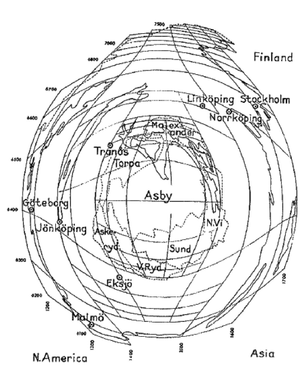

# fisheye


[](https://codecov.io/gh/riatelab/fisheye)




D'après Bunge 1962 p. 54 : 

Bunge, W. (1962) Theoretical Geography, Lund Studies in Geography General and Mathematical
Geography No. 1, Department of Geography, University of Lund, Lund.

D'après : 

Hägerstrand, T. (1957) Migration and Area: A Survey of a Sample of Swedish Migration Fields and
Hypothetical Considerations of the Genesis, Lund Studies in Geography, Series B, Human Geography,
Department of Geography, University of Lund, Lund.


```{r}
library(sf)
library(fisheye)
library(mapsf)

# data import
ncraw <- st_read(system.file("shape/nc.shp", package="sf"), quiet = TRUE)
nc <- st_transform(ncraw, 3857)
center <- st_centroid(st_geometry(nc[51, ]))


buf_size <- c(
  seq(100,1000, 100),
  seq(1000,10000,1000),
  seq(10000, 100000, 10000)
)
lb <- vector("list", length(buf_size))
for (i in seq_along(lb)){
  lb[[i]] <- st_buffer(center, buf_size[i])
}
buf <- st_sf(geom = do.call(c, lb))


mf_init(nc)
mf_map(nc, col ="grey90", border = "white", add = T)
mf_map(buf, add = T, border = "red", col = NA, lwd = .4, lty = 3)
mf_map(buf[c(10,20,30), ], add = T, border = "red", col = NA, lwd = 1, lty = 1)
mf_map(center, pch = 20, add = TRUE)
for (i in c(20, 30)){
  text(st_coordinates(center)[1,1], st_bbox(buf[i, ])[4], paste0(round(buf_size[i]/1000, 0),  "km"))
}


buffe <- fisheye(buf, centre = center, method = "log", k = 1)
ncfe  <- fisheye(nc, centre = center, method = "log", k = 1)
mf_init(buffe)
mf_map(ncfe, add=T)
mf_map(buffe, add = T, border = "red", col = NA, lwd = .4, lty = 3)
mf_map(buffe[c(1,10,20,30), ], add = T, border = "red", col = NA, lwd = 1, lty = 1)
points(0,0,pch = 20)
for (i in c(1,10,20,30)){
  text(0, st_bbox(buffe[i, ])[4], paste0(signif(buf_size[i]/1000, 0),  "km"))
}


```


